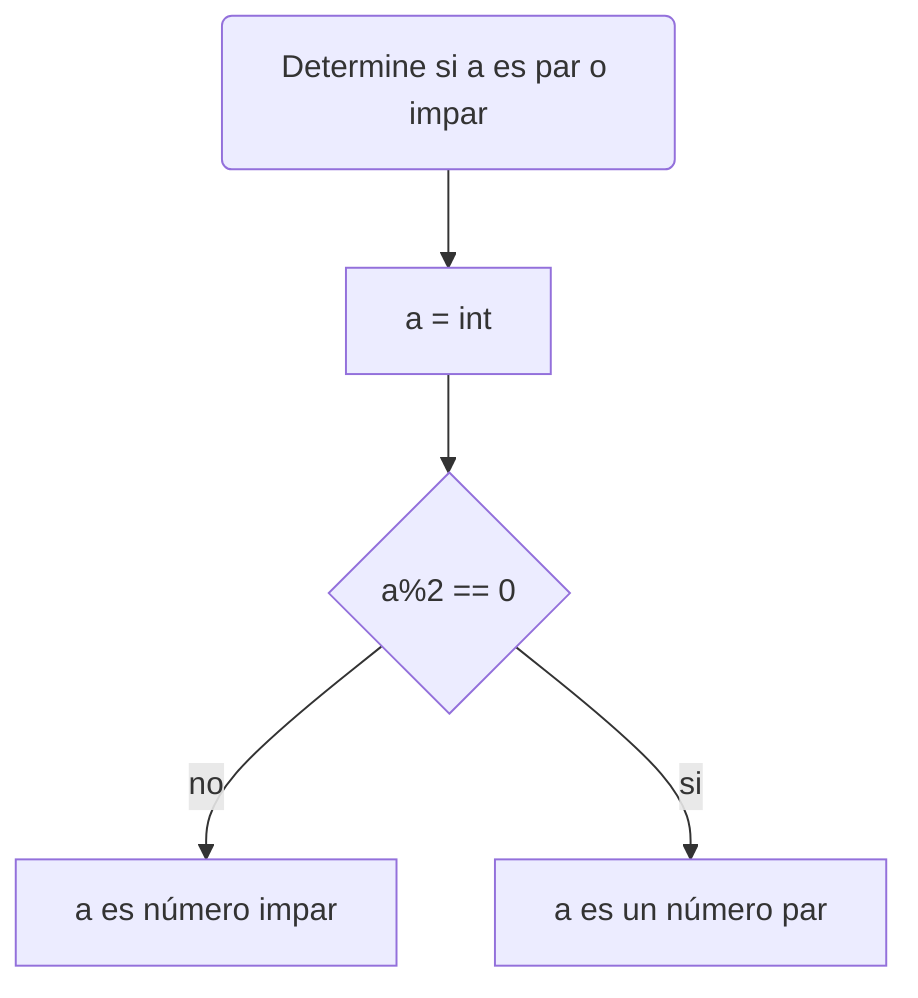

# Taller #1

**Equipo:  "Los comillas"**
- Juan Camilo Morales Hernandez
- Arturo Moreno Covaría
- Victor Sebastián Santiago Acosta

Espero que se encuentren excelente estimados lectores, en el presente repo desarrollaremos los puntos propuestos en el [taller número 1](https://github.com/fegonzalez7/pdc_unal_clase8), de nuestra clase de programación de computadores.
## - Punto 1:
Realice el quiz Python Beginner Quiz (20 preguntas) y adjunte pantallazo con el resultado (mínimo 90% bien).

- Quiz Juan Camilo Morales Hernandez:


- Quiz Arturo Moreno Covaría:


- Quiz Victor Sebastian Santiago Acosta:

[](https://postimg.cc/nX3mz7yw)

## - Punto 2:
Problema: Realice un programa que lea tres números reales y determine cuál es el mayor.

Para utilizamos los conocimientos previos vistos en clase, para este fue fundamental el and y el mayor que, ya que para comparar los 2 número necesitabamos comparar que número era mayor y el "and" para saber si ese número era mayor que los otros dos y si es así nos dijera que es verdadero. Se adjunta imagen, la caja donde se explica linea por linea del código y el diagrama de flujo.


```
x : float # Se declaro la variable x
y : float # Se declaro la variable y
g : float # Se declaro la variable g
x = float(input("Ingrese el primer número: ")) # Cada variable se declara y se reliaza el codigo para ingresar a cuanto equivale la variable
y = float(input("Ingrese el segundo número: ")) # Cada variable se declara y se reliaza el codigo para ingresar a cuanto equivale la variable
g = float(input("Ingrese el tercer número: ")) # Cada variable se declara y se reliaza el codigo para ingresar a cuanto equivale la variable
if x > y and x > g : # Se pone un condicional
    print(""+ str(x) +" es el número mayor de los 3 ingresados.") # Sí cumple el condicional anterior, impirme la siguiente oracíon
elif y > x and y > g : # Sino cumplio el condicional anterior, se reliza este condicional
    print(""+ str(y) +" es el número mayor de los 3 ingresados.") # Sí cumple el condicional imprime la siguiente oración 
elif g > x and g > y : # Sino cumplio el condicional anterior, se reliza este condicional
    print(""+ str(g) +" es el número mayor de los 3 ingresados.") # Sí cumple el condicional imprime la siguiente oración 
```


El código del diagrama de flujo se encuentra para que lo prueben en mermaid.

```
flowchart TD
    A[Variables] -->|"a, b, c"| B(inicio)
    B --> C{ a es mayor que b y c?}
    C --> |Sí| R[a es el número mayor]
    C --> |Sino| D{ b es mayor que a y c?}
    D --> |Sí| d[ b es el número mayor]
    D --> |Sino| m{ c es mayor que a y b?}
    m --> |Sí| k[c es el número mayor]
    R --> h(fin)
    d --> h(fin)
    k --> h(fin)
 ```
## - Punto 3:
Problema: Realice un programa que lea un número enteros y determine si es par o impar.

Para resolver el anterior ejercicio se debe tener en cuenta los operadores aritméticos propios del lenguaje de progrmación en Python, específicamente el del módulo, el cual usa el símbolo (%) y nos retorna el residuo de la división entre dos números.
  1. Declarar la variable.
  ```sh
  a : int
  ```
  
  
  2. Solicitar el ingreso de una cifra numérica.
   ```sh
  a = int(input("Ingrese un numero: "))
  ```
  
  
  3. Usando el operador artimético del módulo (%) se determina si el residuo de la división del valor ingresado entre dos es igual a 0.
   ```sh
  if a%2 == 0:
  ```
  
  
  4. Si es verdadera la afirmación imprimir que el número ingresado efectivamente es un dígito par.
  ```sh
  print("El numero "+str(a)+" es par")
  ```
  
  
  5. Si no se cumple el condicional, imprimir que el número ingresado es impar.
  ```sh
  else:
  print("El numero "+str(a)+" es impar")
  ```
  

A continuación el pseudocódigo completo de la solución al problema:
```sh
a : int
a = int(input("Ingrese un numero: ")) 
if a%2 == 0:
  print("El numero "+str(a)+" es par")
else:
  print("El numero "+str(a)+" es impar")
```

El programa funcionando se ve de la siguiente forma:
Ingresando como ejemplo el número 5


Ingresando como ejemplo el número 32


El siguiente diagrama de flujo explica de manera visual el proceso mencionado anteriormente:

## - Punto 4:
Realice un programa que lea dos números reales y determine si el primero es múltiplo del segundo.
## Codigo:
```python
# declaro las variables 
a: float
b: float
# Pido que ingresen un numero y despues el otro
a = float(input("ingrese el primer número " ))
b = float(input("ingrese el segundo número"))
# Imprime los numeros ingrasados
print("el primer número es "+ str(a))
print("el segundo número es "+str(b) )
# Si el residuo de a entre b es cero se imprime que el primero es multiplo
# del sugundo sino se imprime el primero no es multiplo del segundo
if a%b==0:
  print("El primer numero es multiplo del segundo")
else:
  print("El primer numero no es multiplo del segundo")
 ```
## Programa Funcionando:
[](https://postimg.cc/HcbrMLsF)

[](https://postimg.cc/87sB6h83)

## - Punto 5:
Problema: Realice un programa que lea tres números reales y determine si la suma de los dos primeros es mayor, menor o igual que el tercer número.

Para resolver utilizamos las desigualdades y los condicionales, en los 3 casos donde sea mayor, menor o igual.


```
x : float # Se declaro la variable x
y : float # Se declaro la variable y
g : float # Se declaro la variable g
x = float(input("Ingrese el primer número: ")) # Cada variable se declara y se reliaza el codigo para ingresar a cuanto equivale la variable
y = float(input("Ingrese el segundo número: ")) # Cada variable se declara y se reliaza el codigo para ingresar a cuanto equivale la variable
g = float(input("Ingrese el tercer número: ")) # Cada variable se declara y se reliaza el codigo para ingresar a cuanto equivale la variable
if x + y > g : # Se condiciona, si la suma de los 2 primeros números son mayores
    print("la suma de los 2 primero números ingresados es mayor al tercero.") # Sí se cumple la condición, imprime la oración
elif x + y < g : # Sino cumplio la anterior condicíón, se realiza el siguiente condicional, la suma de los 2 primeros números es menor que el tercero
    print("la suma de los 2 primero números ingresados es menor al tercero.") # Sí se cumple la condición, imprime la oración
else: # Sino cumple ninguna
     print("la suma de los 2 primero números ingresados es igual al tercero.") # imprime la oración
```

## - Punto 6:
Escriba un programa que solicite al usuario una letra y determine si es una vocal o una consonante.

1. Solicitar el ingreso de una letra.
  ```sh
  a = str(input("Ingrese una letra: "))
  ```
  
  
2. Condicionar el ingreso de la variale con cada vocal, minúscula y mayúscula e imprimir que efectivamente el caracter ingresado es una vocal, si se cumple la condición.
  ```sh
 if a == "a" or a == "A":
    print("la letra "+str(a)+" es una vocal")
elif a == "e" or a == "E":
    print("la letra "+str(a)+" es una vocal")
elif a == "i" or a == "I":
    print("la letra "+str(a)+" es una vocal")
elif a == "o" or a == "O":
    print("la letra "+str(a)+" es una vocal")
elif a == "u" or a == "U":
    print("la letra "+str(a)+" es una vocal")
   ```
  

3. Si no se cumple el anterior condicional imprimir que la letra ingresada corresponde a una consonante.
  ```sh
  else:
    print("la letra "+str(a)+" es una consonante")
  ```
  

A continuación el código correspondiente para determinar si una letra ingresada es vocal o consonante
```sh
a = str(input("Ingrese una letra: "))
if a == "a" or a == "A":
    print("la letra "+str(a)+" es una vocal")
elif a == "e" or a == "E":
    print("la letra "+str(a)+" es una vocal")
elif a == "i" or a == "I":
    print("la letra "+str(a)+" es una vocal")
elif a == "o" or a == "O":
    print("la letra "+str(a)+" es una vocal")
elif a == "u" or a == "U":
    print("la letra "+str(a)+" es una vocal")
else:
    print("la letra "+str(a)+" es una consonante")
```

El programa funcionando se ve de la siguiente manera:

   Ejemplo con la letra "u":
   


  
  Ejemplo con la letra "w":
  


## - Punto 7:
Escriba un programa que pida 5 números reales y calcule las siguientes operaciones:

- El promedio
- La mediana
- El promedio multiplicativo (multiplica todos y luego calcula la raíz de la cantidad de operadores)
- Ordenar los números de forma ascendente
- Ordenar los numeros de forma descendente
- La potencia del mayor número elevado al menor número
- La raíz cúbica del menor número

## Codigo:
```python
# Se declaran las variables que va se van a utilizar en el programa
a:float
b:float 
c:float
d:float
e:float
m1:float
m2:float
m3:float
m4:float
m5:float
promedio : float
potencia : float
promult : float 
raizm : float 
# Se pide lque se ingresen los 5 números reales 
a = float(input("Ingrese el primer número real: "))
b = float(input("Ingrese el segundo número real: "))
c = float(input("Ingrese el tercer número real: "))
d = float(input("Ingrese el cuarto número real: "))
e = float(input("Ingrese el quinto número real: "))
# El programa nos imprimira los números ingresados 
print ("los números ingresados son ("+ str(a)+ ", "+ str(b)+", "+ str(c)+ ", "+str(d)+ ", "+str(e) +")" )
# Se calcula el promedio por lo que se dividira los suma de los números ingresados por 5 que es la 
# la cantidad de tatos que se tienen que ingresar 
promedio = (a+b+c+d+e)/5
# se imprime el resultado del promedio 
print("El promedio es "+ str(promedio))
# se utilizan  condicionales para indicarnos cual variable es menor que otra y asignarle alas  variables un
# nuevo nombre la mas pequeña sera m1, luego m2, m3 m4 y  m5 que sera la mas grande 
if a<b and a<c and a<d and a<e:
    m1=a
    if b<c and b<d and b<e:
       m2=b
       if c<d and c<e:
          m3=c
          if d<e:
             m4=d ; m5=e 
          else : 
             m4=e ; m5=d 
    elif c<b and c<d and c<e:
       m2=c
       if b<d and b<e:
          m3=b
          if d<e:
             m4=d ; m5=e 
          else : 
             m4=e ; m5=d 
    elif d<b and d<c and d<e:
       m2=d
       if b<c and b<e:
          m3=b
          if c<e:
              m4=c ; m5=e 
          else : 
             m4=e ; m5=c
    elif e<b and e<c and e<d:
       m2=e
       if b<c and b<d:
          m3=b
          if b<d:
              m4=b ; m5=d
          else : 
             m4=d ; m5=b 
elif b<a and b<c and b<d and b<e:
    m1=b
    if a<c and a<d and a<e:
       m2=a 
       if c<d and c<e:
          m3=c
          if d<e:
             m4=d ; m5=e 
          else : 
             m4=e ; m5=d 
    elif c<a and c<d and c<e:
       m2=c
       if a<d and a<e:
          m3=a
          if d<e:
             m4=d ; m5=e 
          else : 
             m4=e ; m5=d 
    elif d<a and d<c and d<e:
       m2=d
       if a<c and a<e:
          m3=a
          if c<e:
              m4=c ; m5=e 
          else : 
             m4=e ; m5=c
    elif e<a and e<c and e<d:
       m2=e
       if a<c and a<d:
          m3=a
          if a<d:
              m4=a ; m5=d 
          else : 
             m4=d ; m5=a
if c<b and c<a and c<d and c<e:
    m1=c
    if b<a and b<d and b<e:
       m2=b 
       if a<d and a<e:
          m3=a
          if d<e:
             m4=d ; m5=e 
          else : 
             m4=e ; m5=d 
    elif a<b and a<d and a<e:
       m2=a
       if b<d and b<e:
          m3=b
          if d<e:
             m4=d ; m5=e 
          else : 
             m4=e ; m5=d 
    elif d<b and d<a and d<e:
       m2=d
       if b<a and b<e:
          m3=b
          if a<e:
              m4=a ; m5=e 
          else : 
             m4=e ; m5=a 
    elif e<b and e<a and e<d:
       m2=e
       if b<a and b<d:
          m3=b
          if b<d:
              m4=b ; m5=d 
          else : 
             m4=d ; m5=b
if d<b and d<c and d<a and d<e:
    m1=d
    if b<c and b<a and b<e:
       m2=b 
       if c<a and c<e:
          m3=c
          if a<e:
              m4=a ; m5=e 
          else : 
             m4=e ; m5=a 
    elif c<b and c<a and c<e:
       m2=c
       if b<a and b<e:
          m3=b
          if d<e:
            if d<e:
             m4=d ; m5=e 
          else : 
             m4=e ; m5=d 
    elif a<b and a<c and a<e:
       m2=a
       if b<c and b<e:
          m3=b
          if c<e:
              m4=c ; m5=e 
          else : 
             m4=e ; m5=c
    elif e<b and e<c and e<a:
       m2=e
       if b<c and b<a:
          m3=b
          if b<a:
              m4=b ; m5=a 
          else : 
             m4=a ; m5=b
if e<b and e<c and e<d and e<a:
    m1=e
    if b<c and b<d and b<a:
       m2=b 
       if c<d and c<a:
          m3=c
          if d<a:
              m4=d ; m5=a 
          else : 
             m4=a ; m5=d 
    elif c<b and c<d and c<a:
       m2=c
       if b<d and b<a:
          m3=b
          if d<a:
              m4=d ; m5=a 
          else : 
             m4=a ; m5=d 
    elif d<b and d<c and d<a:
       m2=d
       if b<c and b<a:
          m3=b
          if c<a:
              m4=c ; m5=a 
          else : 
             m4=a ; m5=c 
    elif a<b and a<c and a<d:
       m2=a
       if b<c and b<d:
          m3=b
          if b<d:
              m4=b ; m5=d 
          else : 
             m4=d ; m5=b  
# Se calcula la potencia del numero mayor elavado al menor
potencia = m5**m1
# se calcula el promedio multiplicativo
promult= (m1*m2*m3*m4*m5)**(1/5)
# se calcula la raiz del número menor 
raizm = (m1)**(1/2)
# se imprimen los resultados 
print("la mediana es "+ str(m3))
print("El promedio multilpicativo es "+ str(promult))
print("los numeros en orden descendente son ("+ str(m5)+ ", "+ str(m4)+", "+ str(m3)+ ", "+str(m2)+ ", "+str(m1) +")") 
print("los numeros en orden ascendente son ("+ str(m1)+ ", "+ str(m2)+", "+ str(m3)+ ", "+str(m4)+ ", "+str(m5) +")") 
print("la potencia del mayor numero elvado el menor numero  es "+ str(potencia))
print("la raiz del menor número es " + str (raizm))
```
## Programa Funcionando:
[](https://postimg.cc/14pmcTch)
## Punto 8:
Problema: Escriba un programa al que se le ingrese la frecuencia de una onda en hz y como salida arroje en que parte del espectro electromagnético se encuentra.

Para este problema toco buscar las regiones del espectroelectromagnetico, para realizar los condicionales de los rangos se utilizo mayor, menor y "and".


```
a : float # Se declara la variable a
a = float(input("Ingrese la frecuencia en Hz sin notación científica: ")) # Se ingresa la frecuencia a la que se le quiere hallar su region
if a < 30 * 10**3 : # Se define un rango para saber si la frecuencia dada se encuentra en esa región
    print('La frecuencia que ingreso se encuentra en la región "Muy Baja Frecuencia"') # Sí se encuentra en ese rango. imprime la oración
elif a >= 30 * 10**3 and a < 650 * 10**3 : # Sino esta en el rango anterior, se evalua si se encuentra en este rango
    print('La frecuencia que ingreso se encuentra en la región "Onda Larga"') # Sí se encuentra en ese rango. imprime la oración
elif a >= 650 * 10**3 and a <  1.7 * 10**6 : # Sino esta en el rango anterior, se evalua si se encuentra en este rango
    print('La frecuencia que ingreso se encuentra en la región "Onda Media"') # Sí se encuentra en ese rango. imprime la oración
elif a >=  1.7 * 10**6 and a < 30 * 10**6: # Sino esta en el rango anterior, se evalua si se encuentra en este rango
    print('La frecuencia que ingreso se encuentra en la región "Onda Corta"') # Sí se encuentra en ese rango. imprime la oración
elif a >= 30 * 10**6 and a < 300 * 10**6 : # Sino esta en el rango anterior, se evalua si se encuentra en este rango
    print('La frecuencia que ingreso se encuentra en la región "Muy Alta Frecuencia"') # Sí se encuentra en ese rango. imprime la oración
elif  a >= 300 * 10**6 and a < 3 * 10**8 : # Sino esta en el rango anterior, se evalua si se encuentra en este rango
    print('La frecuencia que ingreso se encuentra en la región "Ultra Alta Frecuencia"') # Sí se encuentra en ese rango. imprime la oración
elif a >= 3 * 10**8 and a < 300 * 10**9 : # Sino esta en el rango anterior, se evalua si se encuentra en este rango
    print('La frecuencia que ingreso se encuentra en la región "Microondas"') # Sí se encuentra en ese rango. imprime la oración
elif a >= 300 * 10**9 and a < 6 * 10**12 : # Sino esta en el rango anterior, se evalua si se encuentra en este rango
     print('La frecuencia que ingreso se encuentra en la región "Infrarrojo lejano/submilimétrico"') # Sí se encuentra en ese rango. imprime la oración
elif a >= 6 * 10**12 and a < 120 * 10**12 : # Sino esta en el rango anterior, se evalua si se encuentra en este rango
    print('La frecuencia que ingreso se encuentra en la región "Infrarrojo medio"') # Sí se encuentra en ese rango. imprime la oración
elif a >= 120 * 10**12 and a < 384 * 10**12 : # Sino esta en el rango anterior, se evalua si se encuentra en este rango
    print('La frecuencia que ingreso se encuentra en la región "Infrarrojo cercano"') # Sí se encuentra en ese rango. imprime la oración
elif a >= 384 * 10**12 and a < 7.89 * 10**14 : # Sino esta en el rango anterior, se evalua si se encuentra en este rango
    print('La frecuencia que ingreso se encuentra en la región "Espectro Visible"') # Sí se encuentra en ese rango. imprime la oración
elif a >= 7.89 * 10**14 and a < 1.5 * 10**15 : # Sino esta en el rango anterior, se evalua si se encuentra en este rango
    print('La frecuencia que ingreso se encuentra en la región "Ultravioleta cercano"') # Sí se encuentra en ese rango. imprime la oración
elif a >= 1.5 * 10**15 and a < 30 * 10**15 : # Sino esta en el rango anterior, se evalua si se encuentra en este rango
    print('La frecuencia que ingreso se encuentra en la región "Ultravioleta extremo"') # Sí se encuentra en ese rango. imprime la oración
elif a >= 30 * 10**15 and a < 30 * 10**18 : # Sino esta en el rango anterior, se evalua si se encuentra en este rango
    print('La frecuencia que ingreso se encuentra en la región "Rayos X"') # Sí se encuentra en ese rango. imprime la oración
elif a >= 30 * 10**18 : # Sino esta en el rango anterior, se evalua si se encuentra en este rango
    print('La frecuencia que ingreso se encuentra en la región "Rayos gamma"') # Sí se encuentra en ese rango. imprime la oración
else: # Sino se encuentra en ningun rango
    print("No hay frenciencias negativas") # Sí no se encuentra es porque se ingreso un número negativo
```
## Punto 9:
Escriba un programa que reciba el nombre en minúsculas de un país de America y devuelva la ciudad capital, si el país no pertenece al continente debe arrojar pais no identificado
## Codigo:
```python
# Se pide al usuario  que ingre un pais 
pais = input("ingrese un país de america en minisculas ")
# se declaran variables con nombres de los paises de america
char1 = "antigua y barbuda"; char2 = "argentina"; char3 = "bahamas "
char4 = "barbados "; char5 = "belice"; char6 = "bolivia"
char7 = "brasil"; char8 = "canada"; char9 = "chile"
char10 = "colombia"; char11 = "costa rica"; char12 = "cuba "
char13 = "dominica"; char14 = "ecuador"; char15 = "el salvador"
char16 = "estados unidos "; char17 = "granada"; char18 = "guatemala"
char19 = "guyana"; char20 = "haiti"; char21 = "honduras"
char22 = "jamaica"; char23 = "mexico "; char24 = "nicaragua"
char25 = "panama"; char26 = "paraguay"; char27 = "peru"
char28 = "republica dominicana"; char29 = "san cristibal y nieves"
char30 = "san vicente y las granadinas "; char31 = "santa lucia"
char32 = "surinam"; char33 = "trinidad y tovago "
char34 = "uruguay"; char35 = "venezuela"
# El programa busca si el pais ingresado corresponde con una de las variables preestablecidas
# si  es asi el programa imprime la capital si no imprime pais no identificado 
if pais == char1 :
    print("la capital de "  + str(pais)+ " es saint john")
elif pais == char2 :
    print("la capital de "  + str(pais)+ " es buenos aires ")
elif pais == char3 :
    print("la capital de "  + str(pais)+ " es nasau")
elif pais == char4 :
    print("la capital de "  + str(pais)+ " es bridgertown")
elif pais == char5 :
    print("la capital de "  + str(pais)+ " es belmopan")
elif pais == char6 :
    print("la capital de "  + str(pais)+ " es sucre")
elif pais == char7 :
    print("la capital de "  + str(pais)+ " es brasilia")
elif pais == char8 :
    print("la capital de "  + str(pais)+ " es ottawa")
elif pais == char9 :
    print("la capital de "  + str(pais)+ " es santiago")
elif pais == char10 :
    print("la capital de "  + str(pais)+ " es bogota")
elif pais == char11 :
    print("la capital de "  + str(pais)+ " es san jose")
elif pais == char12 :
    print("la capital de "  + str(pais)+ " es la habana")
elif pais == char13 :
    print("la capital de "  + str(pais)+ " es roseau")
elif pais == char14 :
    print("la capital de "  + str(pais)+ " es quito")
elif pais == char15 :
    print("la capital de "  + str(pais)+ " es san salvador")
elif pais == char16 :
    print("la capital de "  + str(pais)+ " es washintown")
elif pais == char17 :
    print("la capital de "  + str(pais)+ " es saint george")
elif pais == char18 :
    print("la capital de "  + str(pais)+ " es ciudad de guatemala")
elif pais == char19 :
    print("la capital de "  + str(pais)+ " es georgetown")
elif pais == char20 :
    print("la capital de "  + str(pais)+ " es puerto principe")
elif pais == char21 :
    print("la capital de "  + str(pais)+ " es tegucigalpa")
elif pais == char22 :
    print("la capital de "  + str(pais)+ " es kinston")
elif pais == char23 :
    print("la capital de "  + str(pais)+ " es ciudad de mexico")
elif pais == char24 :
    print("la capital de "  + str(pais)+ " es managua")
elif pais == char25 :
    print("la capital de "  + str(pais)+ " es ciudad de panama")
elif pais == char26 :
    print("la capital de "  + str(pais)+ " es asunción ")
elif pais == char27 :
    print("la capital de "  + str(pais)+ " es lima")
elif pais == char28 :
    print("la capital de "  + str(pais)+ " es santo domingo")
elif pais == char29 :
    print("la capital de "  + str(pais)+ " es basseterre")
elif pais == char30 :
    print("la capital de "  + str(pais)+ " es kingstown")
elif pais == char31 :
    print("la capital de "  + str(pais)+ " es castris")
elif pais == char32 :
    print("la capital de "  + str(pais)+ " es paramaribo")
elif pais == char33 :
    print("la capital de "  + str(pais)+ " es purto españa")
elif pais == char34 :
    print("la capital de "  + str(pais)+ " es montevideo ")
elif pais == char35 :
    print("la capital de "  + str(pais)+ " es caracas")
else:
    print("país no identificado")
```
## Programa Funcionando:
[](https://postimg.cc/Y4hZh6sX)
## Diagrama de flujo .
[](https://postimg.cc/YhxQmJc9)

## - Punto 10:
Problema: Escriba un programa que dada una distancia calcule

* El tiempo que le tomaría a la luz recorrer la distancia.
* El tiempo que le tomaría al sonido (en el aire) recorrer la distancia.
* El tiempo que le tomaría al vehiculo comercial más veloz recorrer la distancia.
* El tiempo que le tomaría a Bolt recorrer la distancia.

Para resolver dicho problema se debe tener en cuenta determinadas constantes físicas, tales como la velocidad de la luz, la velocidad del sonido en el aire, entre otras.

| Constante | Valor en (m/s) |
| ------ | ------ |
| Velocidad de la luz | 299792458 |
| Velocidad del sonido en el aire | 343 |
| Velocidad máxima del vehículo comercial más veloz | 141.111 |
| Velocidad de Usaint Bolt en Berlín 2009 | 10.44

1. Declarar las constantes que se usarán como tipo flotantes.
   ```sh
   a = float
   b = float
   c = float
   d = float
   e = float
    ```
      
 
  
 2. Establecer las determinadas variables físicas en una misma unidad de medida, en este caso la unidad de medida será el metro por segundo (m/s)
   ```sh
   a = 299792458 # Velocidad de la luz
   c = 343 # Velocidad del sonido en el aire
   d = 141.111 # Velocidad vehículo comercial más veloz
   e = 10.44 # Velocidad Usain Bolt
   ```
   
   
   
   
  3. Solicitar el ingreso del valor de la distancia
   ```sh
   b = float(input("ingrese el valor de la distancia en m: "))
   ```
  
  
  4. Establecer las relaciones entre las variables presentes, dividiendo la distancia entre la velocidad, para que de esta manera se tenga el tiempo en segundos como resultado. 
  ```sh
   tiempo1 = b / a
   tiempo2 = b / c
   tiempo3 = b / d
   tiempo4 = b / e
   ```
   
   
   5. Imprimir los valores del tiempo, relacionandos con cada velocidad establecida anteriormente.
   ```sh
   print("la luz tarda "+str(tiempo1)+" segundos en recorrer "+str(b)+" metros")
   print("El sonido tarda "+str(tiempo2)+" segundos en recorrer "+str(b)+" metros en el aire")
   print("El vehículo comercial más rápido tardaría "+str(tiempo3)+" segundos en recorrer "+str(b)+" metros")
   print("Usain Bolt tardaría "+str(tiempo4)+" segundos en recorrer "+str(b)+" metros")
   ```
   


Así es el código completo que resulve y ejecuta el problema en cuestión

```sh
a = 299792458
c = 343
d = 141.111
e = 10.44
b = float(input("ingrese el valor de la distancia en m"))
tiempo1 = b / a
tiempo2 = b / c
tiempo3 = b / d
tiempo4 = b / e
print("la luz tarda "+str(tiempo1)+" segundos en recorrer "+str(b)+" metros")
print("El sonido tarda "+str(tiempo2)+" segundos en recorrer "+str(b)+" metros en el aire")
print("El vehículo comercial más rápido tardaría "+str(tiempo3)+" segundos en recorrer "+str(b)+" metros")
print("Usain Bolt tardaría "+str(tiempo4)+" segundos en recorrer "+str(b)+" metros")
```
##
De esta manera se ve el código funcionando


